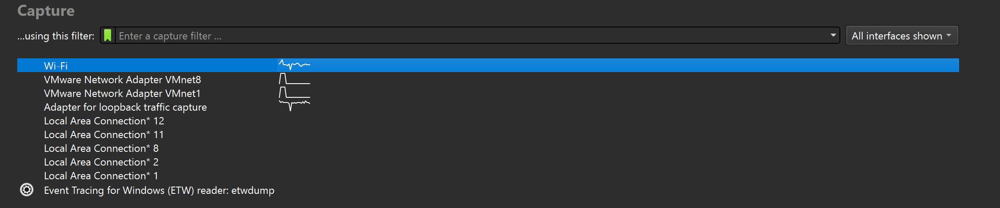

## Praktik menggunakan Wireshark

1. Jalankan wireshark, kemudian pilih interface yang ingin di lihat trafficnya pilih Wi-Fi untuk wireless interface
2. Kemudian sebagai percobaan buka website http://gaia.cs.umass.edu/wireshark-labs/INTRO-wireshark-file1.html dan gunakan http untuk memfilter hanya protokol "http" saja

## Lampiran
Hasil:

