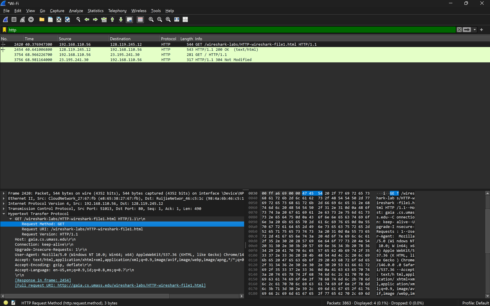
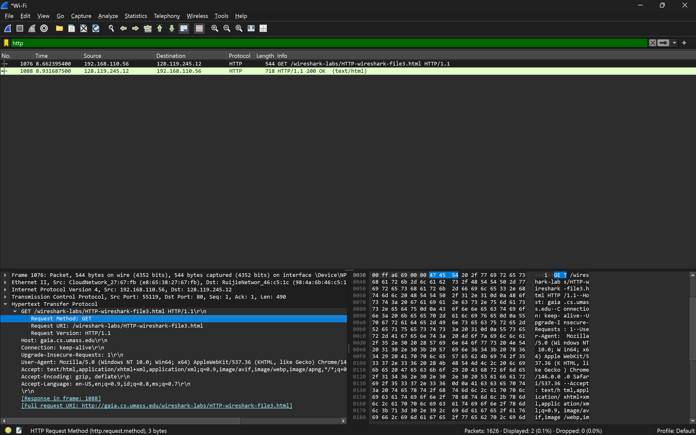
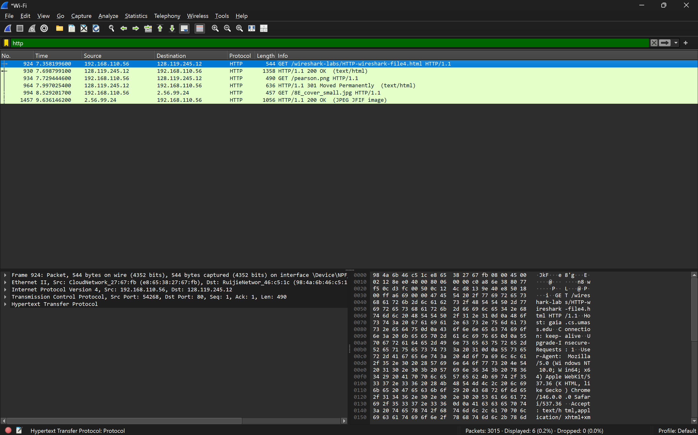

# LAPORAN PRAKTIKUM IF-04-01

## TUJUAN PRAAKTIKUM
Menginvestigasi cara kerja protokol HTTP menggunakan Wireshark

## Hasil Dan Penjelasan
1. Basic HTTP GET/response interaction
Step-Step:
- Capture menggunakan Wireshark
- Akses Link http://gaia.cs.umass.edu/wireshark-labs/HTTP-wireshark-file1.html
- Stop dan filter "HTTP"

outputnya

2. HTTP Conditional GET/response interaction
Step-step
- Capture Menggunakan Wireshark
- Akses Link http://gaia.cs.umass.edu/wireshark-labs/HTTP-wireshark-file2.html
- Stop dan filter "HTTP"

output

3. Retrieving Long Documents
Step-step
- Capture Menggunakan Wireshark
- Akses Link http://gaia.cs.umass.edu/wireshark-labs/HTTP-wireshark-file3.html
- Stop dan filter "HTTP"

output 

4. HTML Documents dengan Embedded Objects
Step-Step 
- Capture menggunakan Wireshark
- Akses Link http://gaia.cs.umass.edu/wireshark-labs/HTTP-wireshark-file4.html
- Stop dan filter "HTTP"

output

5. HTTP Authentication
Step-Step 
- Capture Mengguakan Wireshark
- Akses Link http://gaia.cs.umass.edu/wireshark-labs/protected_pages/HTTP-wireshark-file5.html input usn "wireshark-students" dan pass "network"
- Stop dan filter "HTTP"

output 
!
[hasil-Percobaan](../assets/image/file5.png)

## KESIMPULAN
HTTP bekerja dengan prinsip request-response, di mana klien mengirim permintaan (misal GET) dan server merespons dengan status serta konten. Untuk efisiensi, HTTP mendukung caching; jika konten belum berubah, server mengirim 304 Not Modified. File besar dibagi menjadi segmen TCP agar bisa dikirim dan diterima dengan benar. Namun, mekanisme keamanan HTTP standar lemah karena data autentikasi seperti username dan password hanya dikodekan dengan Base64, bukan dienkripsi.

