# LAPORAN PRAKTIKUM IF-04-01

## TUJUAN PRAAKTIKUM
mengenvestigasi DNS menggunakan Wireshark

## Hasil dan Penjelasan

## Nslookup

1. Nslookup
nslookup www.mit.edu

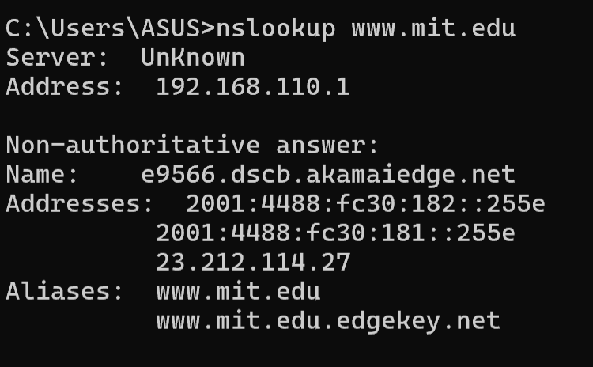
jawaban dari perintah atas yaitu
nama & alamat IP server DNS 
jawaban dari perintah tersebut "Host" & "IP" www.mit.edu

2. nslookup –type=NS mit.edu
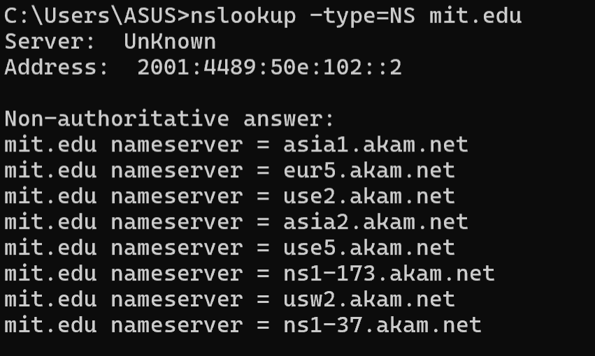
- Perintah ini meminta server DNS lokal untuk mencari nama host dari server DNS otoritatif milik MIT.
- Hasil menampilkan server DNS lokal yang menjawab

3. Query ke DNS Server Tertentu
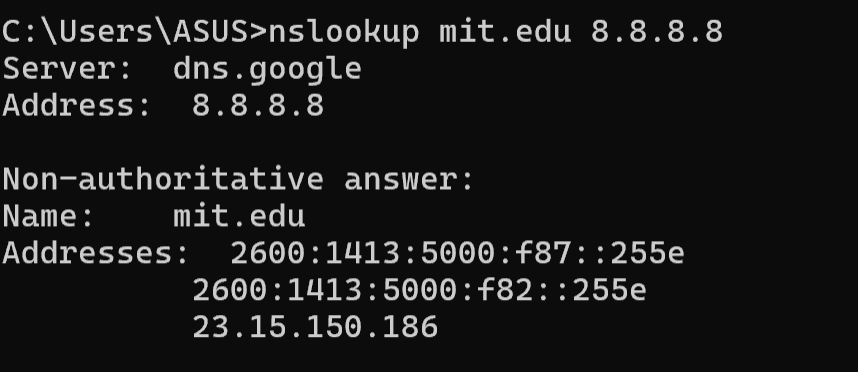
Eksekusi perintah nslookup www.aiit.or.kr 8.8.8.8 bertujuan untuk melakukan query DNS terhadap domain tertentu dengan menggunakan server DNS spesifik.
- Tujuan: Mencari alamat IP dari hostname
- pesifikasi Server: Argumen tambahan "8.8.8.8" menginstruksikan nslookup untuk mengirimkan query langsung ke server Google Public DNS.

4. Query Alamat IP Server Web di Asia
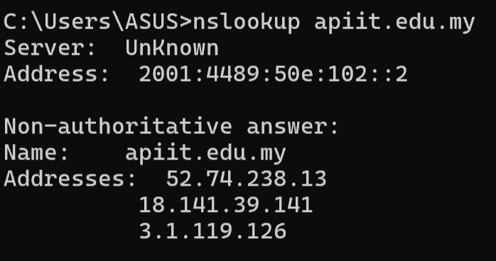
- Address adalah alamat IP dari server DNS lokal yang menangani permintaan.

5. Query MX Record (Server Email)
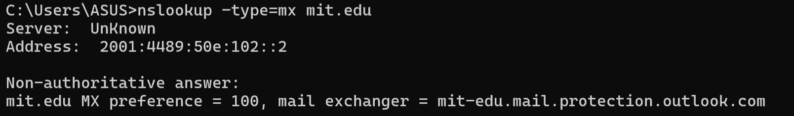
- Parameter -type=MX menginstruksikan nslookup untuk mencari Mail Exchanger (MX) records
- MX preference = 4 merupakan angka prioritas menentukan urutan prioritas server email.

## IPConfig

1. ipconfig /all
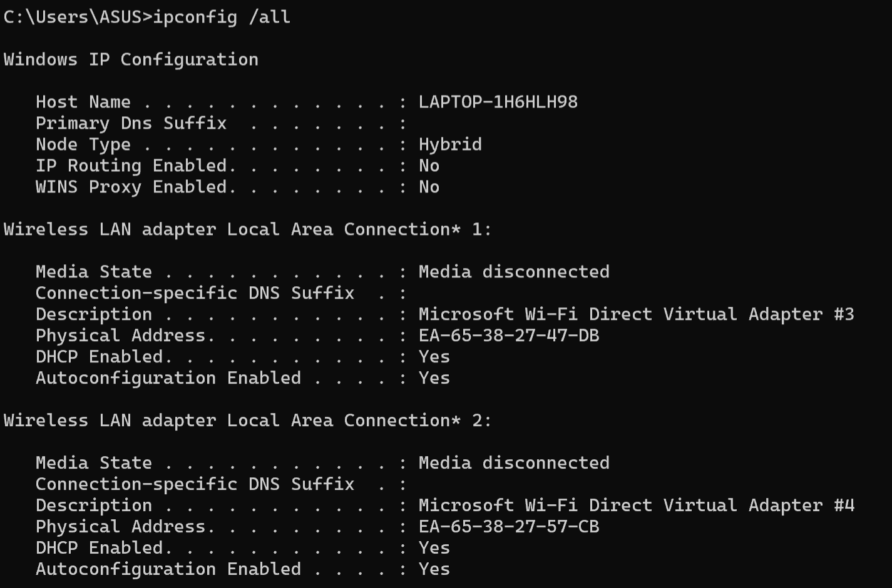
.png)
- Dengan ipconfig /all dapat memperoleh semua informasi tentang host.
- IPv4 Address: Alamat laptop di jaringan lokal.
- Subnet Mask: Menentukan rentang jaringan.
- Default Gateway: Alamat router / modem.
- dll

2. ipconfig /displaydns
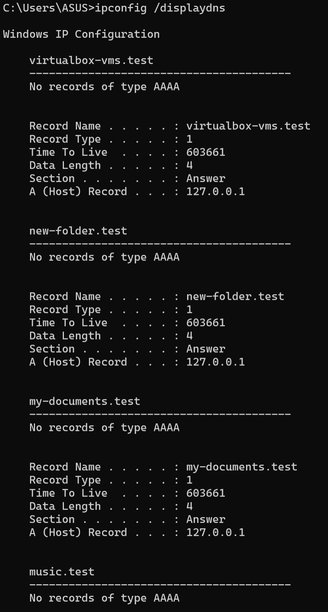
- Perintah ini berguna untuk melihat record yang telah disimpan.
- Hasil yang didapatkan akan menampilkan record dan sisa Time To Live (TTL) dalam satuan detik. 

## Tracing DNS dengan Wireshark
A. Tracing DNS Tanpa nslookup
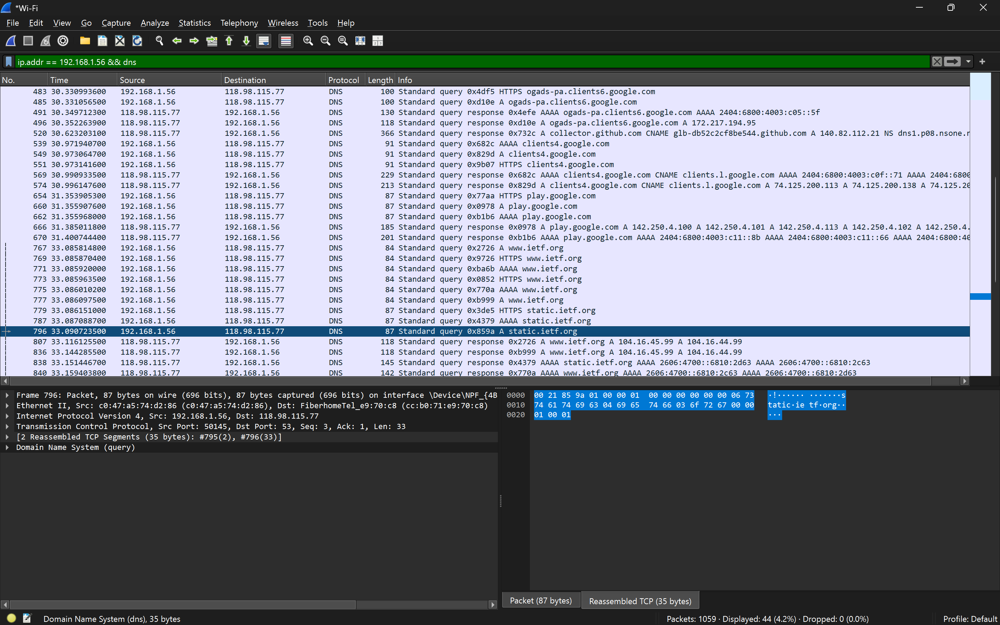
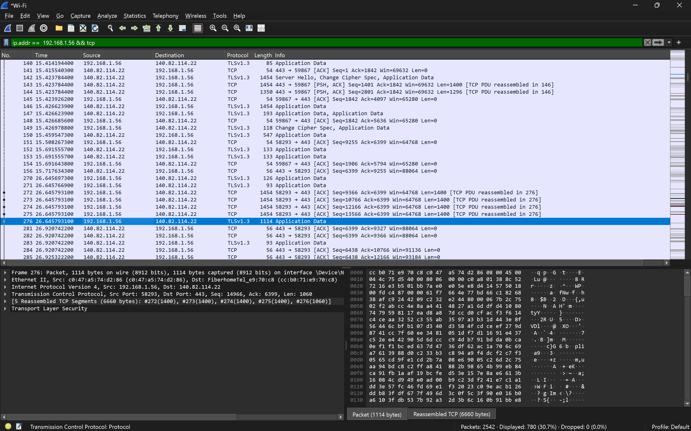

Pertanyaan dan Jawaban
1. Apakah pesan tersebut dikirimkan melalui UDP atau TCP?
** Pesan permintaan dan balasan DNS tersebut dikirimkan melalui protokol UDP.

2. Apa port tujuan pada pesan permintaan DNS? Apa port sumber pada pesan balasannya?
- **Port tujuan (Destination Port) pada pesan permintaan DNS (Frame 798) adalah 53 (port standar untuk DNS).
- **Port sumber (Source Port) pada pesan balasan (Frame 1548) juga adalah 53. Port tujuan dari sebuah query akan menjadi port sumber saat server memberikan balasan.

3. Pada pesan permintaan DNS, apa alamat IP tujuannya? Apa alamat IP server DNS lokal anda? Apakah kedua alamat IP tersebut sama?

- **Alamat IP tujuan pada permintaan DNS (Frame 796) adalah 118.98.155.77
- **Alamat IP server DNS lokal kamu adalah 118.98.155.77.
Ya, kedua alamat IP tersebut sama.

4. Apa "jenis" atau "type" dari pesan tersebut? Apakah pesan permintaan tersebut mengandung "jawaban" atau "answers"?
 - Jenis (type) dari pesan permintaan tersebut adalah Tipe A (mencari alamat IPv4).

 5. Berapa banyak "jawaban" atau "answers" yang terdapat di dalamnya? Apa saja isi yang terkandung dalam setiap jawaban tersebut?

**terdapat 2 jawaban

6. Apakah alamat IP pada paket TCP SYN sesuai dengan alamat IP yang tertera pada pesan balasan DNS?

**YA

7. Apakah host Anda perlu mengirimkan pesan permintaan DNS baru setiap kali ingin mengakses suatu gambar?

** Host tidak perlu mengirimkan permintaan DNS baru jika gambar berada di domain yang sama karena alamat IP-nya akan disimpan dalam cache DNS lokal komputer untuk beberapa waktu

B. Tracing DNS dengan nslookup
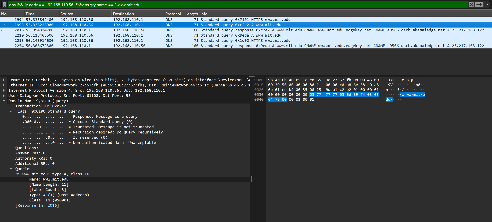

Pertanyan dan Jawaban
1.Apa port tujuan pada pesan permintaan DNS? Apa port sumber pada pesan balasan DNS?
- **DNS query → port tujuan = 53.
- **DNS response → port sumber = 53.

2. Ke alamat IP manakah pesan permintaan DNS dikirimkan? Apakah alamat IP tersebut merupakan default alamat IP server DNS lokal Anda?
**Pesan permintaan DNS dikirimkan ke alamat IP tujuan 192.168.110.1 yang juga merupakan 
default server DNS lokal.

3. Periksa pesan permintaan DNS. Apa "jenis" atau "type" dari pesan tersebut? Apakah pesan tersebut mengandung "jawaban" atau "answers"?
- **Jenis atau type dari pesan permintaan tersebut adalah Type A (Host Address).
- **Pesan permintaan tersebut tidak mengandung "jawaban".

4. Periksa pesan balasan DNS. Berapa banyak "jawaban" atau "answers" yang terdapat di dalamnya? Apa saja isi yang terkandung dalam setiap jawaban tersebut?
**Terdapat 3 "jawaban" (Answer RRs: 3) di dalam pesan balasan DNS tersebut:
- **Jawaban 1 (CNAME): Menyatakan bahwa www.mit.edu adalah sebuah alias (Canonical Name) yang merujuk ke nama www.mit.edu.edgekey.net.
- **awaban 2 (CNAME): Menyatakan bahwa www.mit.edu.edgekey.net juga merupakan sebuah alias yang merujuk lebih lanjut ke nama e9566.dscb.akamaiedge.net.
- **Jawaban 3 (Type A): Memberikan alamat IPv4 asli untuk host terakhir tersebut,IP 23.217.163.122.

C. Query ke DNS Server Spesifik
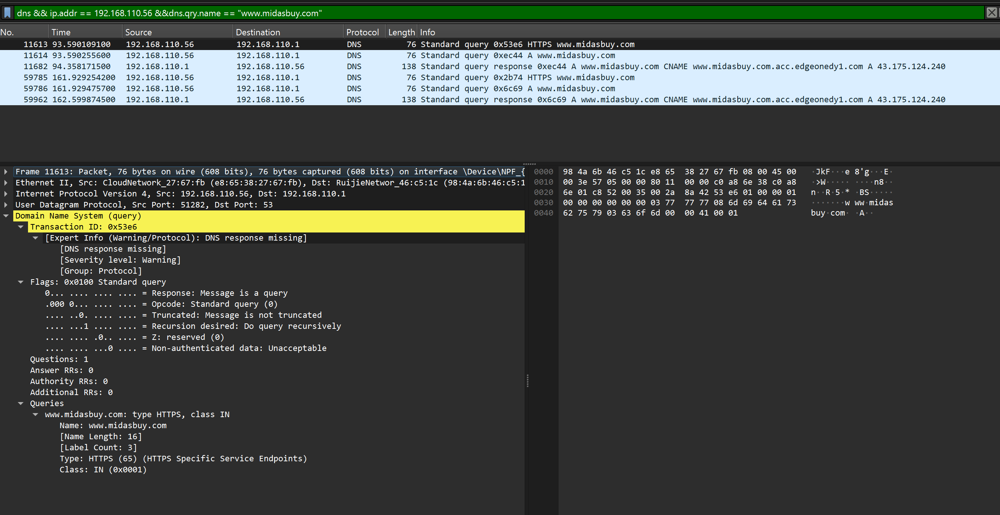
Pertanyaan dan Jawaban
1. Ke alamat IP manakah pesan permintaan DNS dikirimkan? Apakah alamat IP tersebut merupakan default alamat IP server DNS lokal Anda?
- **Pesan permintaan DNS dikirimkan ke alamat IP tujuan 192.168.110.1.

2. Periksa pesan permintaan DNS. Apa "jenis" atau "type" dari pesan tersebut? Apakah pesan tersebut mengandung "jawaban" atau "answers"?
- **Jenis dari pesan tersebut adalah Type A (Host Address). Tidak mengandung Jawaban

3. Periksa pesan balasan DNS. Berapa banyak "jawaban" atau "answers" yang terdapat di dalamnya? Apa saja isi yang terkandung dalam setiap jawaban tersebut?
 ** berisi 2 alamat IP
 - **Balasan ditandai oleh paket dengan Source dan Destination terbalik 192.168.110.1 → 192.168.110.56.
